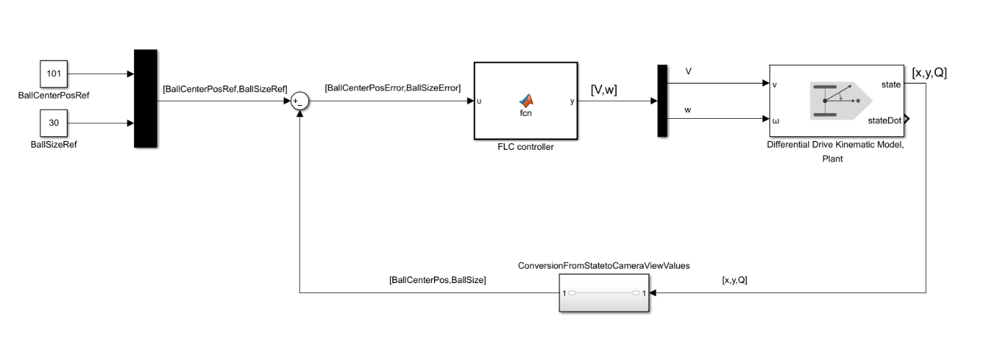
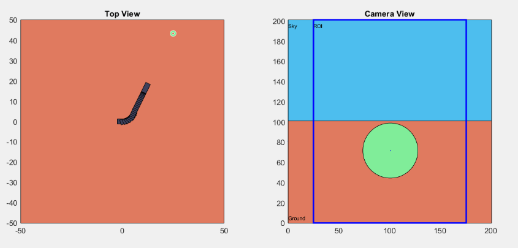

# Fuzzy Controller for a Differential Drive Robot

A simple differential drive robot carries a 201x201 pixel camera on the middle of the co axis
of wheel shaft rotaion. Velocity (v) of the robot controls the translational motion
of the camera on the plane and angular velocity (w) controls the orientation of the camera.

There are two variables in the system which we to control; the distance and the angle
between the robot and a ball. Control of these variables are is done by using a vision system with a
201 × 201 𝑝𝑖𝑥𝑒𝑙 camera. The distance is related to the area that ball covers on the screen in
pixels, and the angle is related to the x (horizontal) position of the ball on the screen.
Reference inputs are also given in this context. Desired robot size is 30 𝑝𝑖𝑥𝑒𝑙2 whereas
desired horizontal position is 101 𝑝𝑖𝑥𝑒𝑙 if we consider the leftmost 𝑝𝑖𝑥𝑒𝑙’s index as 1.
Comparison of these reference inputs with the feedback values is made and given to the
fuzzy controller as horizontal position error and angle error. Output of the controller is given
as inputs to the plant and states are observed to be used as feedbacks.

Block Diagram of the Closed Loop Controller In Simulink: 

To showcase the algorithm extreme values of distance and angle according to the constraints
are chosen and results are plotted:

